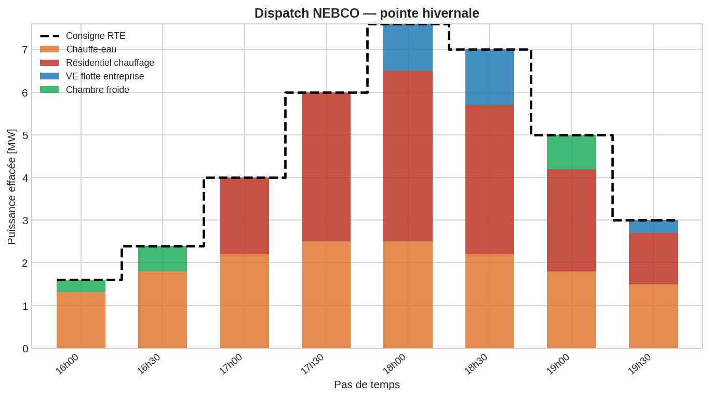
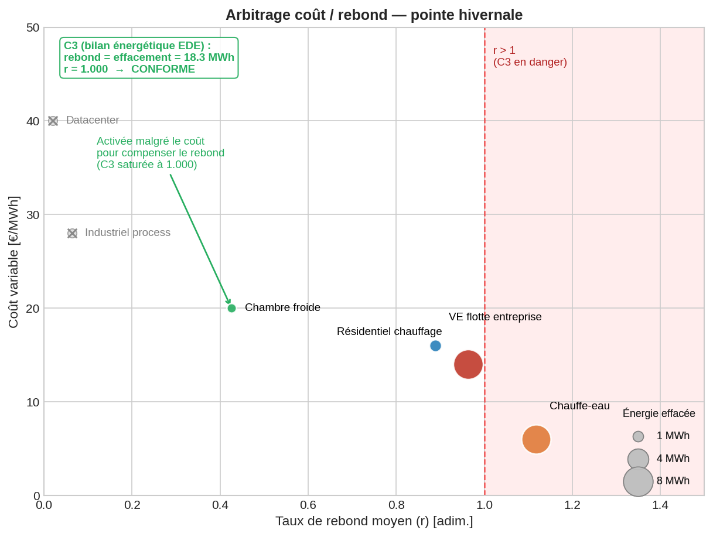
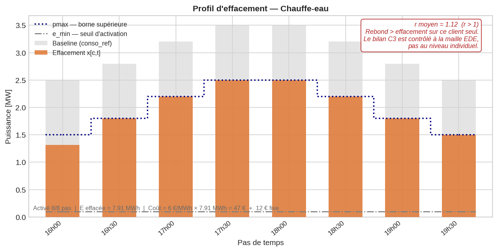
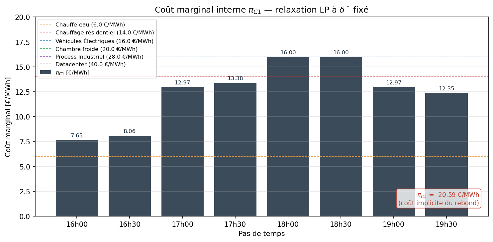

# NEBCO Dispatch — Optimisation interne d'un opérateur d'effacement

## Abstract

*Projet personnel — appropriation des mécanismes d'effacement et de leur récente refonte sous NEBCO, à travers la modélisation du problème de dispatch interne d'un opérateur d'effacement.*

Prototype Python/MILP qui modélise comment un opérateur d'effacement répartit, entre ses clients, un volume de réduction de consommation vendu à RTE sur le marché NEBCO (en vigueur depuis le 01/09/2025). Minimisation du coût interne sous contraintes physiques et réglementaires, formulé avec PuLP + solveur CBC. Ce projet modéliste le dispatch interne post-notification RTE : quand RTE retient une offre d'effacement, comment l'opérateur décide quels clients activer, dans quelle mesure, et à quel moment — en minimisant son coût interne tout en respectant les contraintes réglementaires NEBCO.

## Contexte et vocabulaire NEBCO

Lorsqu'un OE reçoit de RTE un programme d'effacement retenu suite à ses offres sur le mécanisme NEBCO, il doit ventiler ce volume entre les clients de son portefeuille. Ce projet modélise ce **problème de dispatch interne** comme un programme linéaire mixte en nombres entiers (MILP).

La hiérarchie NEBCO des acteurs et périmètres est la suivante (art. 5.F) :

```
Opérateur d'Effacement (OE)              ← personne morale agréée par RTE
  └── Périmètre d'Effacement (PE)        ← un seul PE par OE, non transférable
        ├── EDE 1  (Télérelevée ou Profilée)
        │     ├── Site de Soutirage 1.1
        │     └── Site de Soutirage 1.2
        ├── EDE 2  (Télérelevée ou Profilée)
        │     └── ...
```

L'**Entité d'Effacement (EDE)** est le périmètre contractuel regroupant des sites d'une même typologie. **Le bilan énergétique NEBCO est contrôlé à la maille EDE**, pas au niveau PE ni au niveau site.

L'objectif du dispatch est de minimiser le coût interne de l'OE — compensation versée aux clients + coûts fixes d'activation — sous contraintes physiques (gisement disponible, seuils minimaux) et réglementaires (plafond OE, bilan énergétique NEBCO à la maille EDE).

## Positionnement dans la chaîne décisionnelle

```
Niveau 0  │ Caractérisation portefeuille (baseline, gisement)   ── hors scope
Niveau 1  │ Offre sur le marché NEBCO                           ── hors scope
Niveau 2  │ Dispatch interne post-notification RTE              ── CE PROJET
Niveau 3  │ Pilotage temps réel des équipements                 ── hors scope
```

**Boucle de rétroaction** : le réalisé mesuré au Niveau 3 alimente en retour le Niveau 0 (mise à jour des baselines, de la fiabilité des clients, du gisement effectif), qui conditionne les offres du Niveau 1 du jour suivant.
Un dispatch de mauvaise qualité dégrade l'indicateur de fiabilité de l'OE, ce qui resserre à son tour le plafond réglementaire (art. 5.E.1.3.2.2) — la boucle a donc un effet disciplinant direct sur l'horizon court.

## Formulation

**Variables**
- $x[c,t]$ ∈ ℝ₊ : puissance effacée par le client c au pas t [MW]
- $δ[c,t]$ ∈ {0,1} : activation du client c au pas t

**Objectif** : min Σ ( C^{act}_{c,t}·x[c,t]·Δt + f[c,t]·δ[c,t] )

avec :
- $C^{act}_{c}$ [€/MWh] — **coût variable de compensation** versé au client c proportionnellement à l'énergie effacée. Négocié bilatéralement, supposé stationnaire en v1.
- $f[c,t]$ [€] — **coût fixe d'activation** payé dès que δ[c,t]=1, indépendamment du volume effacé. Modélise les frais de télécommande, l'usure des équipements, et le "crédit de sollicitation" (risque de désengagement client en cas d'activations trop fréquentes). Différencié par (client, pas) pour permettre une modulation contextuelle.

**Contraintes**
- C1 — Livraison exacte de la consigne RTE par pas
- C2 — Plafond réglementaire OE (art. 5.E.1.3.2.2)
- C3 — Bilan énergétique NEBCO : Σ rebond ≤ Σ effacement (maille EDE)
- C4 — Couplage activation/effacement (big-M = borne naturelle)
- C5 — Seuil minimal d'effacement si activé

> Les justifications approfondies des choix de modélisation — choix MILP plutôt que LP, périmètre à une seule EDE sans distinction de profilage, absence du revenu NEBCO et du versement fournisseur dans l'objectif, Position A sur le rebond, bilan C3 sur horizon court vs période glissante, hypothèses exogènes sur baseline et gisement — sont développées dans la [note technique](docs/note-technique.md).

## Structure du projet

```
nebco-dispatch/
├── src/
│   ├── data.py          # dataclasses Client, Consigne, Portfolio
│   ├── model.py         # build_model : construction du MILP
│   ├── solver.py        # solve + check_constraints
│   └── reporting.py     # affichage formaté
├── examples/
│   ├── run_example.py       # scénario de base (4 clients × 6 pas)
│   ├── run_example_peak.py  # scénario pointe hivernale (6 clients × 8 pas)
│   └── plot_dispatch.py     # génération des figures (dispatch, coût/rebond, profil client)
├── tests/
│   └── test_model.py        # tests unitaires et d'intégration
└── docs/
    ├── note-technique.md    # justifications approfondies des choix de modélisation
    └── figures/             # figures générées par plot_dispatch.py
```

## Installation et utilisation

```bash
git clone https://github.com/paulmoma/nebco-dispatch.git
cd nebco-dispatch
pip install -r requirements.txt

# Lancer les exemples
python -m examples.run_example
python -m examples.run_example_peak

# Générer les figures
python -m examples.plot_dispatch

# Lancer les tests
python -m unittest discover tests
```

**Dépendances** : [PuLP](https://coin-or.github.io/pulp/) (≥ 2.7) pour la modélisation MILP, avec le solveur [CBC](https://github.com/coin-or/Cbc) embarqué par défaut.

Exemple d'utilisation :

```python
from src import Client, Consigne, Portfolio, build_model, solve, print_full_report

portfolio = Portfolio(clients=[...])
consigne = Consigne(e_retenu=[1.0, 1.2, 1.5], delta_t=0.5, P_max_agr=6.0)

prob, variables = build_model(portfolio, consigne)
solution = solve(prob, variables)
print_full_report(solution, portfolio, consigne)
```

## Exemple — scénario de pointe hivernale

Un opérateur d'effacement doit livrer 18.3 MWh sur l'horizon 16h-19h30 (8 pas demi-horaires) en réponse à une consigne RTE retenue sur NEBCO. Le modèle dispatche cette demande entre 6 clients du portefeuille selon leurs paramètres physiques (gisement, seuils, taux de rebond) et économiques (coût variable, coût fixe d'activation).

### Vue globale du dispatch



La consigne RTE (en escalier noir pointillé) est suivie pas à pas par une combinaison de 4 clients activés. À 18h00, pointe à 7.6 MW : le client "Véhicule électrique" apparaît pour compléter le client "Chauffage résidentiel" saturé à sa borne supérieure. Les clients "datacenter" et "process industriel" ne sont pas activés sur ce scénario.

### Arbitrage coût / rebond du modèle



Le modèle choisit ses clients selon deux critères couplés : leur **coût variable** (axe Y) et leur **taux de rebond moyen** (axe X). Trois enseignements :

- Les clients **non activés** (datacenter, industriel process, en gris) sont trop coûteux pour ce volume cible — le modèle préfère sursolliciter les clients moins chers même proches de la limite de rebond.
- Le client **chambre froide** est activé bien que relativement coûteux (20 €/MWh) : son faible taux de rebond (0.42) permet de **compenser le rebond élevé** du chauffe-eau et de la flotte de Véhicules électriques, et de saturer C3 à 1.000 sans la violer.
- C3 (bilan énergétique EDE) impose que le rebond total ne dépasse pas l'effacement total sur l'horizon. Ici, 18.3 / 18.3 MWh → ratio = 1.000, **bilan conforme**.

### Diagnostic au niveau d'un client : le chauffe-eau



Le chauffe-eau est l'un des clients les plus sollicités sur ce scénario (activé sur les 8 pas, 7.91 MWh effacés). Son taux de rebond individuel atteint 1.12 — donc **r > 1 au niveau du client seul**. C'est admissible : la contrainte C3 du modèle s'applique à la maille EDE, pas client par client. Le rebond local est compensé par les clients à faible rebond (chambre froide notamment) dans le bilan agrégé.

### Coûts marginaux internes — relaxation LP



Le coût marginal interne $\pi_{C1}[t]$ représente le coût supplémentaire d'un MWh de consigne RTE au pas $t$, à plan d'activation $\delta^*$ fixé. 
Il reflète le coût variable du client marginal, corrigé par le multiplicateur de rebond $\pi_{C3} (ici −20.59 €/MWh sur le scénario de pointe hivernale): les clients à fort rebond (Chauffe-eau) voient leur coût effectif augmenter, les clients à faible rebond (Chambre froide) le voient diminuer.

## Limites de la v1

Ce prototype privilégie la lisibilité de la formulation sur la fidélité opérationnelle. Les principales limites, documentées en détail dans la note technique :

- **Un OE, un PE, une seule EDE**, sans distinction de typologie Télérelevée/Profilée.
- **C1 en égalité stricte** — la sous-livraison n'est pas autorisée, alors qu'elle est pénalisée financièrement par RTE, pas interdite.
- **Rebond hors horizon** — taux scalaire $r[c,t]$ qui capte l'ampleur mais pas le timing du rebond.
- **Contrainte C3 bilan énergétique sur l'horizon d'optimisation court** — plus restrictif que le bilan NEBCO réel contrôlé sur période glissante.
- **Pas de contraintes inter-temporelles** par client (durée minimale, temps de repos, nombre max d'activations).
- **Baseline et gisement exogènes** — supposés connus, alors qu'ils font chacun l'objet d'un sous-problème non trivial.
- **Horizon fixe**, pas de redéclaration infrajournalière ; données déterministes.


## Perspectives

Les principales directions d'amélioration sont documentées dans la note technique : relâchement de C1 en inégalité avec pénalité de sous-livraison, ajout de contraintes inter-temporelles par client, modélisation explicite du rebond intra-horizon via une matrice de réponse impulsionnelle, et extension au cas multi-EDE.

## About
Curieux et passionné par les marchés de l'électricité, je me suis rendu compte que je maîtrisais mal les mécanismes d'effacement, qui sont pourtant de formidables outils pour rendre les systèmes électriques européens plus flexibles et résilients. 

En me renseignant sur le nouveau dispositif **NEBCO**, j'ai immédiatement fait le lien avec les problèmes de recherche opérationnelle sur lesquels j'avais travaillé lors de ma formation à l'**ENSTA Paris**. J'ai donc eu envie de modéliser une partie du problème auquel sont confrontés les **Opérateurs d'Effacement**, afin de mieux comprendre le NEBCO et de **remobiliser des compétences** de modélisation et d'optimisation, qui commençaient à être bien enfouies dans mon système neuronal ! Une replongée dans les cours de Jean-Charles Gilbert ([lien](https://who.rocq.inria.fr/Jean-Charles.Gilbert/ensta/cours2a/optim.html)) m'a rappelé à quel point l'univers de la recherche opérationnelle est riche et complexe. 

Loin de prétendre maîtriser aujourd'hui la RO, mon ambition est de **comprendre les modèles, de les implémenter, et d'en tirer des analyses pertinentes**. 


---
Ce travail est mené **en parallèle d’une formation "[Data Engineer & IA](https://le-campus-numerique.fr/formation-data/)"** au **Campus Numérique in the Alps (Grenoble)**. Certaines notions étudiées lors de cette formation pourront compléter ce projet, je pense notamment à l'utilisation de **Machine Learning** pour établir des base-lines de consommation.


## Utilisation des outils d'intelligence artificielle

Dans ce projet, j'ai utilisé des outils d'IA générative (Claude, Anthropic) comme assistant de travail. Concrètement : vérification de la cohérence entre la modélisation et les règles NEBCO, discussion et challenge des pistes de modélisation, aide à la rédaction et à la structuration de la documentation et du README, génération de jeux de données d'exemple, assistance à l'implémentation du module de reporting et détection de bug sur les variables éliminées en presolve par CBC.

Toutes les propositions reçues ont fait l'objet d'une relecture critique. L'IA a accéléré certaines tâches, mais n'a pas substitué le raisonnement.

## Références

- **Cadre légal** — Code de l'énergie, articles [L.271-1](https://www.legifrance.gouv.fr/codes/article_lc/LEGIARTI000031067893) à [L.271-3](https://www.legifrance.gouv.fr/codes/article_lc/LEGIARTI000043214830) (définition de l'effacement, agrément de l'opérateur, régime de versement) et articles [R.271-1](https://www.legifrance.gouv.fr/codes/article_lc/LEGIARTI000033056210) à [R.271-2](https://www.legifrance.gouv.fr/codes/article_lc/LEGIARTI000033056218) (modalités techniques).
- **Règles opérationnelles** — CRE, *Délibération n°2025-199 portant approbation des règles NEBCO*, juillet 2025.
- **Mise en œuvre** — RTE, *Règles de Marché — Chapitre 5 : NEBCO*, version en vigueur au 01/09/2025 — en particulier art. 5.F.
